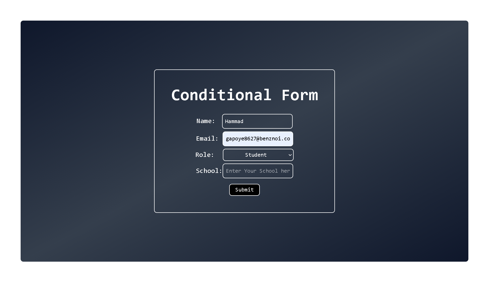
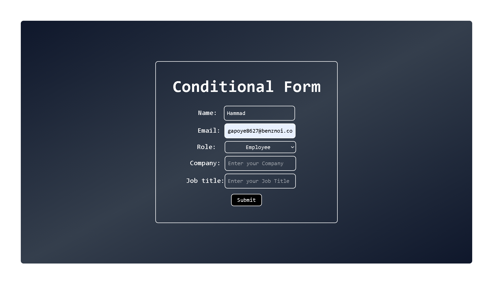
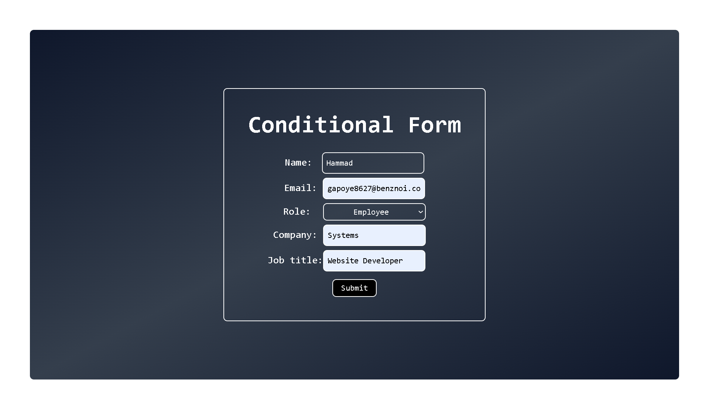

# 📋 Conditional Form with Role-Based Fields

A responsive **Conditional Form** built with **React + Tailwind CSS**, where input fields change dynamically based on the user’s selected role (**Student** or **Employee**).  
This project is part of my **React small projects challenge** to strengthen my React fundamentals.

---

## ✨ Features

- 🎨 Modern UI with Tailwind CSS styling
- 👤 Role-based fields (`Student` or `Employee`)
- 🔄 Controlled inputs with React state
- 🖥️ Responsive layout with gradient background
- 📊 Console logs submitted data for debugging

---

## 🛠️ Tech Stack

- ⚛️ **React** – functional components & hooks (`useState`)
- 🎨 **Tailwind CSS** – for modern responsive styling

---

## 📸 Screenshots

### 📝 Default Form

### 🎓 Student Role Selected

### 💼 Employee Role Selected

---

## ⚡ How It Works

1. User enters **name** and **email**.
2. User selects **role** → either _Student_ or _Employee_.
3. Conditional inputs appear:
   - Student → **School name** field.
   - Employee → **Company + Job Title** fields.
4. On submission:
   - Data is saved in React state.
   - Data is logged in the **console**.
   - A success **alert** is displayed.

---
